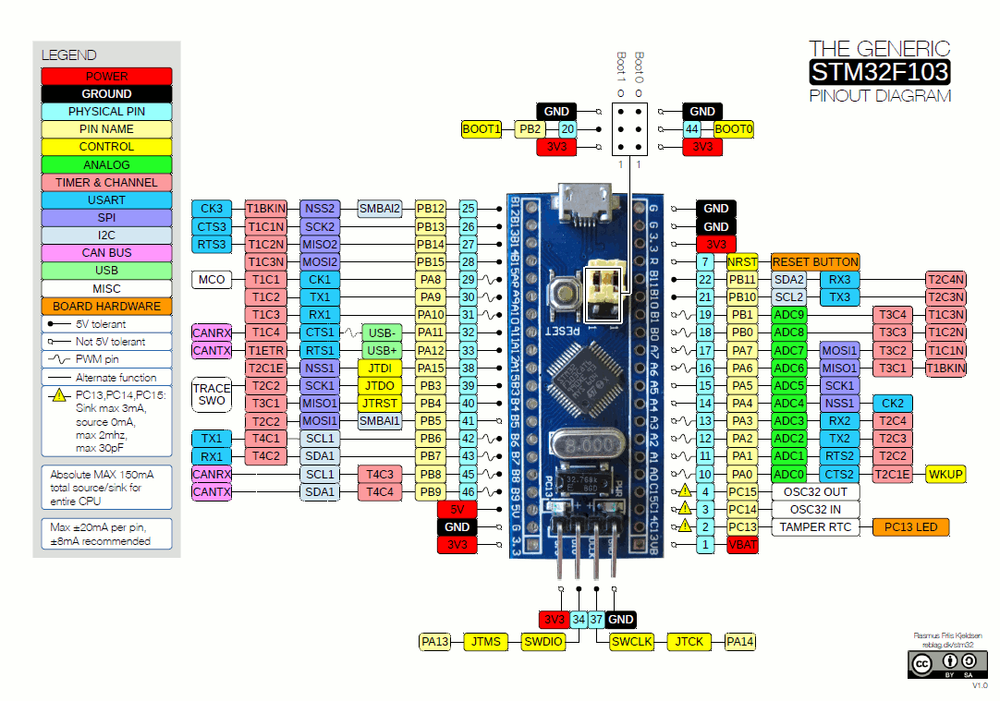

# Experiments with the STM32 Board

## Overview

* https://www.youtube.com/watch?v=KgR3uM21y7o
* https://www.youtube.com/watch?v=EaZuKRSvwdo
* https://www.mikrocontroller.net/articles/STM32_f%C3%BCr_Einsteiger
* https://www.heise.de/developer/artikel/Keine-bittere-Pille-die-Blue-Pill-mit-ARM-Cortex-M3-4009580.html
* https://predictabledesigns.com/introduction-to-programming-stm32-arm-cortex-m-32-bit-microcontrollers/
* https://idyl.io/arduino/how-to/program-stm32-blue-pill-stm32f103c8t6/

## Programming/Examples

* https://github.com/trebisky/stm32f103

## Programmer

* http://www.emcu.eu/stm32-cube-programmer/
* ST-Link v2 https://www.youtube.com/watch?v=KgR3uM21y7o

### Connections

**ATTENTION**: DOUBLE-CHECK YOUR ST-LINK ADAPTER's PINOUT!

| STM32 Blue Pill | ST-LINK V2 |
|---|---|
| 3V3 [Red] | 3.3V (Pin 8) |
| IO   [Orange] | SWDIO   (Pin 2) |
|CLK   [Brown]  |SWDCLK   (Pin 6) |
|GND   [Black]  |GND   (Pin 4) |

## Setup Arduino-IDE

https://www.arduino.cc/en/Guide/Linux

## IDEs

* https://www.st.com/en/development-tools/stm32-ides.html

## CLion

* https://blog.jetbrains.com/clion/2016/06/clion-for-embedded-development/
* https://blog.jetbrains.com/clion/2017/12/clion-for-embedded-development-part-ii/
* https://github.com/nagelkl/clion_embedded
* https://github.com/michaelniedermayr/clion_stm32_openocd

## tinyGo

* https://tinygo.org/microcontrollers/bluepill/
* If error "Error: jtag status contains invalid mode value - communication failure" occurs, see https://github.com/japaric/f3/issues/84 --> hold down Reset-Button while programming

## Rust

* https://github.com/lupyuen/stm32-blue-pill-rust
* https://medium.com/coinmonks/coding-the-stm32-blue-pill-with-rust-and-visual-studio-code-b21615d8a20

## Board Infos

http://wiki.stm32duino.com/index.php?title=Main_Page
http://wiki.stm32duino.com/index.php?title=Main_Page

## Connect Board for serial upload

USB2Serial-Converter (FT232RL) --> STM32 (3v3-Mode!)
* GND --> GND 
* 3V3 --> 3V3 (neighbor of GND) to power the board via converter
* TX --> A10
* RX --> A9

* Power STM32 via microUSB
* Connect USB2Serial-Converter to PC

## Arduino BoardManager

* new URL http://http://dan.drown.org/stm32duino/package_STM32duino_index.json
* install STM32F1xx Board

## Sketch

~~~~~
void setup() {
  pinMode(PA6, OUTPUT);

}

void loop() {
  digitalWrite(PA6, HIGH);
  delay(1000);
  digitalWrite(PA6, LOW);
  delay(1000);
}
~~~~~

Add LED with resistor to Pin6 (A6) and GND.

## Troubleshooting (Linux)

### Upload not possible

* uninstall modemmanager
* try to use USB2 port on your PC, avoid USB-Hub or USB3-port

